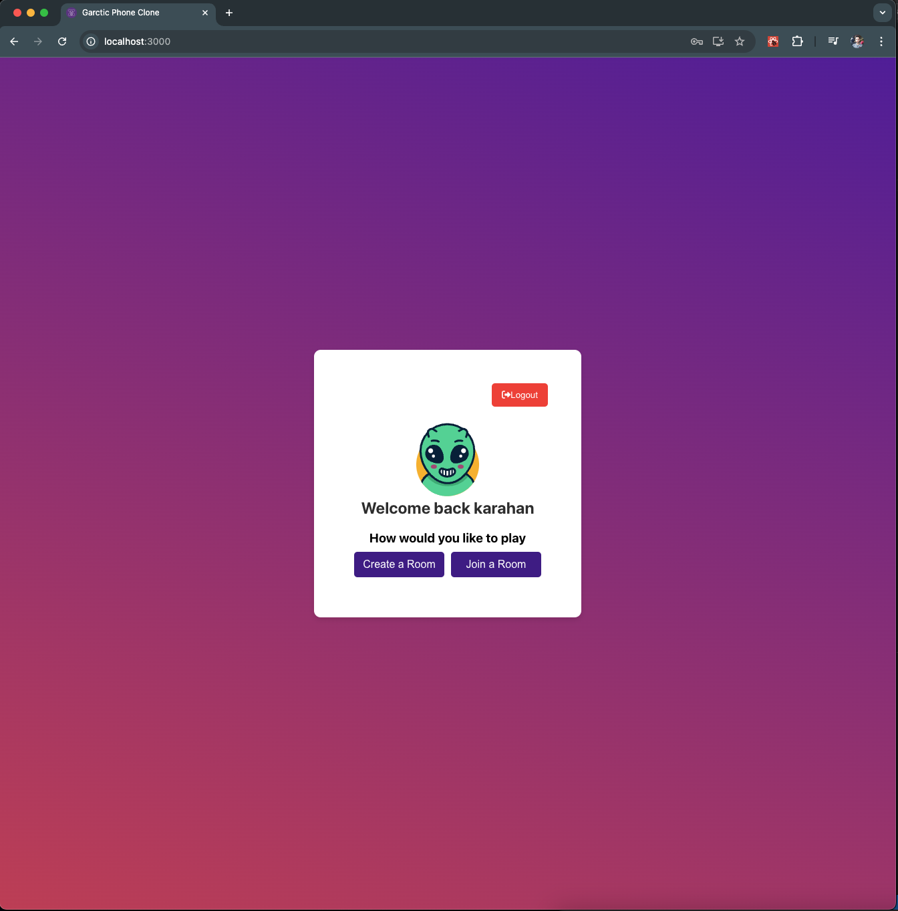
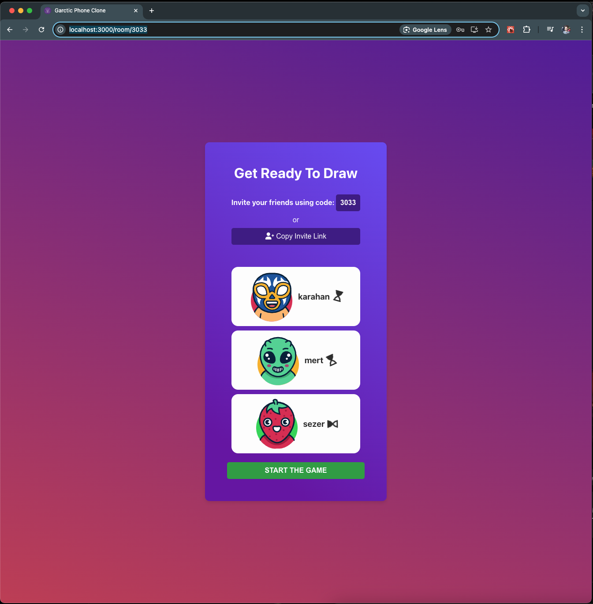
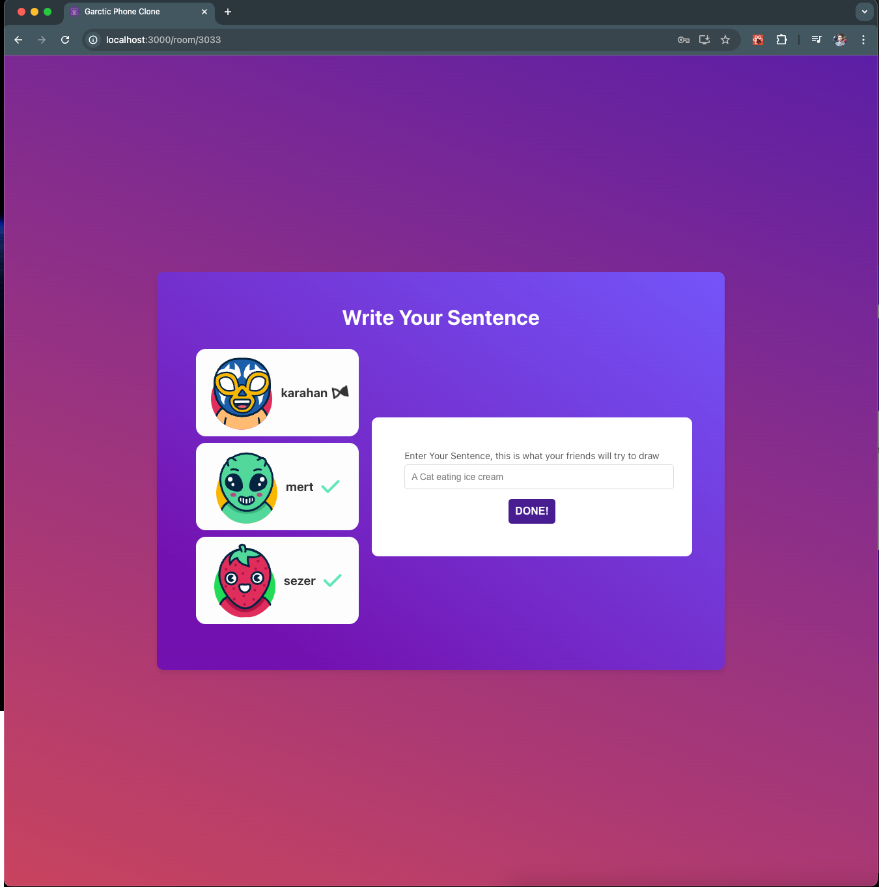
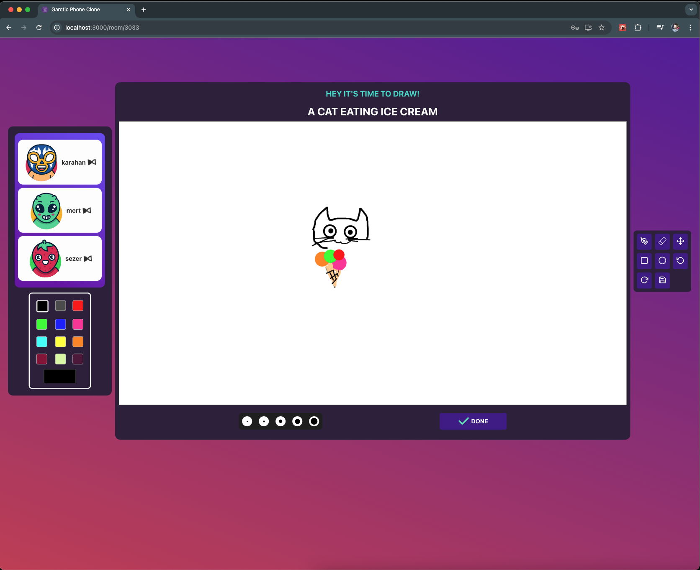

# Garctic Phone Clone - Frontend

This project is the front-end side of Garctic Phone clone, developed with React

## About the project

This game features a robust architecture, utilizing React.js for the frontend and Node.js for the backend. It uses MongoDB for data management and Socket.io for real-time communication

## How to play

1. Login to your account
   

2. Create a lobby and invite your friends
   

3. Enter your initial sentences, they will shared randomly to each player to draw
   

4. Start drawing and repeat the cycle
   

## Getting started

In the project directory, you can run:
install npm packages

### `npm install`

then start the application

### `npm run start`

Note: This frontend requires a running backend service, which can be found in my repositories: https://github.com/karahanozen98/garctic-phone-clone-server